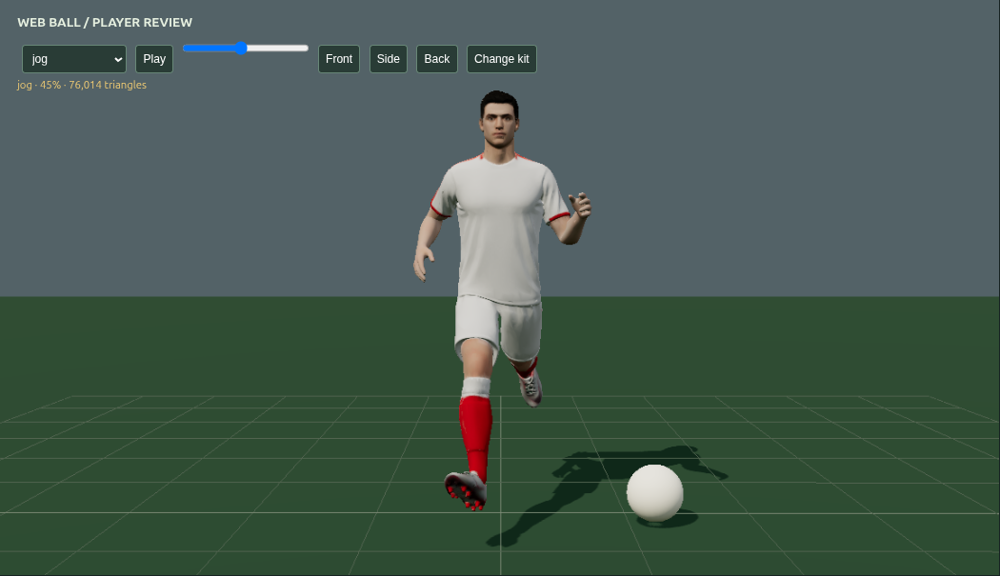
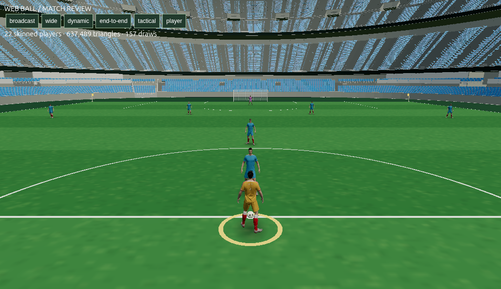
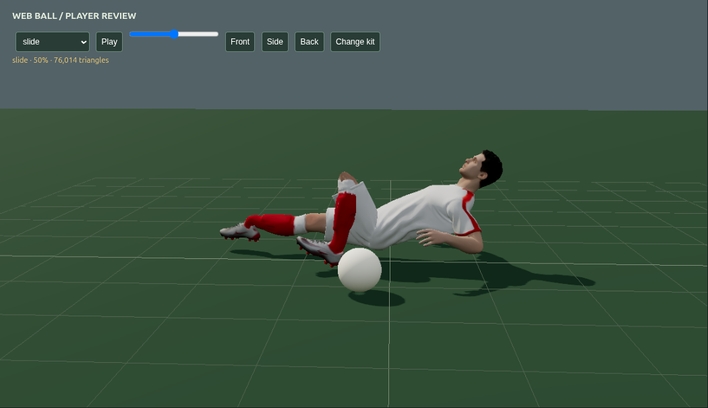

# M1 visual review — 1 October 2026

M1 is still incomplete. These are current hardware WebGL captures from the actual PC, using the supplied footballer and stadium. The rejected MPFB and superhero renders are not the active models.

## Character and match views







The upper body now uses constrained shoulder swing, elbow flexion and neutral wrists. The clavicles follow the torso instead of inheriting the incompatible stylized source rotations. Welding the source's split surfaces before reducing the mesh removed the visible skin and shirt cracks. The ball is 22 cm in diameter in both the engine and renderer.

## Checks performed

- Viewed close front, side and back poses, plus a four-second jogging recording.
- Inspected broadcast, wide, dynamic, end-to-end, tactical and player cameras with 22 independent skinned avatars.
- Advanced the actual match engine at 1/60 second with movement and a pass, rendering its resulting player and ball states.
- Sampled 48 phases of ten clips in Three.js using precise skinned mesh bounds. Ground penetration is below 4 mm for the checked running and planted action clips. Dive and slide checks include the whole body, rather than just soles. [Measurements](previews/m1-oct01/cycle-metrics.json) include the revised slide, whose minimum clearance is 4.5 mm.
- Asset structure checks, all 19 automated tests and the production build passed. Match duration is still six real playing minutes.

## Critique and remaining work

The revised slide lowers the hip joint at its middle pose from roughly 0.55 m to 0.23 m, folds the arms and tucks the trailing leg. Body settling and recovery still need refinement; clearing the ground alone does not establish realistic contact. Source shirt lettering leaves faint traces after runtime color cleanup; a clean team kit atlas should replace that workaround. The empty stadium needs crowd and lighting work. All players currently share one source identity with size and kit variation. Strafe/backpedal blends, goalkeeper dive selection and ball-contact timing are unfinished. Most authored clips are currently available for review rather than triggered by match events.

These captures do not prove sustained frame rate, full match quality, phone performance or physical controller support. The build still warns about the approximately 1.04 MB JavaScript bundle.

## Reproduce locally

Run `npm run dev`, then open:

- `/tools/runtime/asset-review.html` to inspect poses, playback, kit tint and ball scale.
- `/tools/runtime/match-review.html` to inspect the actual renderer with 22 footballers and six cameras.

For saved captures, launch an isolated Chrome review session with remote debugging on port 9222 and run:

```sh
REVIEW_PAGE=asset-review node tools/runtime/capture-review.mjs player-side 'window.reviewPose("jog",0.25,"side")'
REVIEW_PAGE=asset-review node tools/runtime/capture-review.mjs player-motion 'window.reviewRecord("jog","side",4)'
REVIEW_PAGE=match-review node tools/runtime/capture-review.mjs match-player 'window.reviewCamera("player")'
```

PNG, measurement JSON and recorded WebM files are saved under `artifacts/supplied-review/browser/`. Review pages are development tools and are not part of the production entry point.
